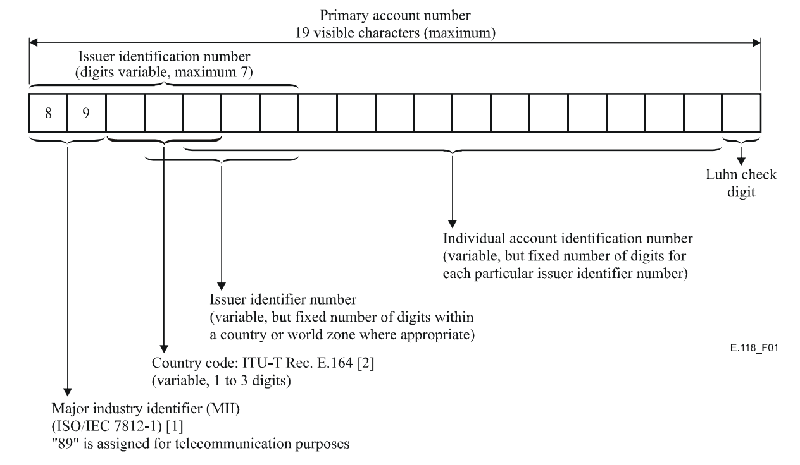

# e118-iin-list [](https://www.npmjs.com/package/e118-iin-list)

[](https://github.com/cellprobe/e118-iin-list/actions)
[](https://github.com/semantic-release/semantic-release)
[](http://commitizen.github.io/cz-cli/)
[](https://github.com/prettier/prettier/)
[](https://github.com/typescript-eslint/typescript-eslint)

List of issuer identification numbers for the international telecommunication
charge card (ITU-T E.118).

Motivation for this list: Since E.118's issuer identification number is of
variable length (it can be 4–7 digits) an
[ICCID](https://en.wikipedia.org/wiki/E.118#ICCID) (the serial number of SIM
cards) needs to be matched against a list of known IINs in order to determine
the SIM issuer.

## Usage

    npm install e118-iin-list

```typescript
import { identifyIssuer } from "e118-iin-list";
import { isSome } from "fp-ts/lib/Option";

const issuer = identifyIssuer("89450421180216254864");
if (isSome(issuer)) {
  console.log(issuer.value.companyName); // Telia Sonera A/S
}
```

## ITU-T Recommendation E.118 Card numbering structure ([Source](https://www.itu.int/rec/dologin_pub.asp?lang=e&id=T-REC-E.118-200605-I!!PDF-E&type=items))

The numbering of the card to be issued by OAs shall be as follows based on
ISO/IEC 7812-1 (Identification cards – Identification of issuers – Part 1:
Numbering system) and ISO/IEC 7812-2 (Identification cards – Identification of
issuers – Part 2: Application and registration procedures).



The maximum length of the visible card number (primary account number) shall be
19 characters and is composed of the following subparts (see Figure 1):

- Major Industry Identifier (MII);
- country code;
- issuer identifier;
- individual account identification number;
- parity check digit computed according to the Luhn formula (see ISO/IEC 7812-1,
  Annex B). In addition to the parity check digit, OAs may incorporate a
  validation check device in some location on the card which could be changed
  when new cards are issued.

### Notes

- the Major Industry Identifier (MII) is always `89` (_telecommunication
  purposes_)
- the Country Code is a positive integer (no leading zeros)
- the Issuer Identifier (IIN) is a _string_ (it has leading zeros) and can be
  entirely made up of `0`

## Generating the list

Sources:

- http://www.itu.int/pub/T-SP-E.118
- https://www.itu.int/pub/T-SP-OB.1183-2019

Process:

1. Download the latest Word Document from http://www.itu.int/pub/T-SP-E.118, and
   copy and past the table into a
   [Google Spreadsheet](https://docs.google.com/spreadsheets/d/1ErJzksU5bF2YA8tQQ9QJleEZHsdvDRDk0Rvi0nf3fh4/edit?usp=sharing).
2. Export that to CSV and store it as `list.csv`
3. Convert to JSON using `npm run convert`
